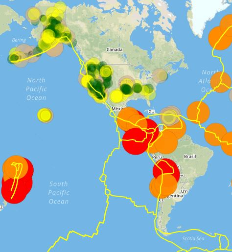
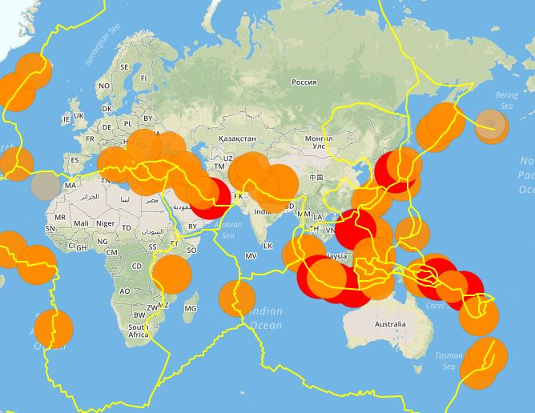

# leaflet-challenge
### Summary
This repository contains an interactive map to explore scientific data about natural hazards by the United States Geological Survey(USGS). 
### Technical Details
In order to run the code, it is required: 
* Google Chrome, Firefox or any other Internet Explorer 
* Utilizes both html and Javascript 
### Screenshots
America.JPG 
  
Continents.JPG 
  
### Explanations 
The outcome is shown in screenshots for reference purpose of the public. 

# leaflet-challenge
Visualizing Data with Leaflet 

The United States Geological Survey (USGS). 
The USGS is responsible for providing scientific data about natural hazards. 
The health of ecosystems and the impacts of climate and land-use change.  
Their scientists develop new methods and tools to supply timely, relevant, and useful information about the Earth and its processes. 
The USGS is interested in building a new set of tools that will allow them visualize their earthquake data.  
They collect a massive amount of data from all over the world each day, but they lack a meaningful way of displaying it. 
Their hope is that being able to visualize their data will allow them to better educate the public and other government organizations (and hopefully secure more funding) on issues facing our planet. 

## Visualization
Visualize an earthquake data set. 
## Get your data set
The USGS provides earthquake data in a number of different formats, updated every 5 minutes. 
Visit the USGS GeoJSON Feed page and pick a data set to visualize.  
Click on a data set 'All Earthquakes from the Past 7 Days' to be given a JSON representation of that data. 
Use the URL of this JSON to pull in the data for our visualization. 

## Import & Visualize the Data
Create a map using Leaflet that plots all of the earthquakes from your data set based on their longitude and latitude.
Data markers should reflect the magnitude of the earthquake in their size and color. 
Earthquakes with higher magnitudes should appear larger and darker in color.
Include popups that provide additional information about the earthquake when a marker is clicked.
Create a legend that will provide context for your map data.

## Optional Challenge

The USGS wants to plot a second data set to illustrate the relationship between tectonic plates and seismic activity. 
Pull in a second data set and visualize it along side your original set of data.
Data on tectonic plates can be found at https://github.com/fraxen/tectonicplates.
Plot a second data set on our map.
Add a number of base maps to choose from as well as separate out the two different data sets into overlays that can be turned on and off independently.
Add layer controls to our map.
